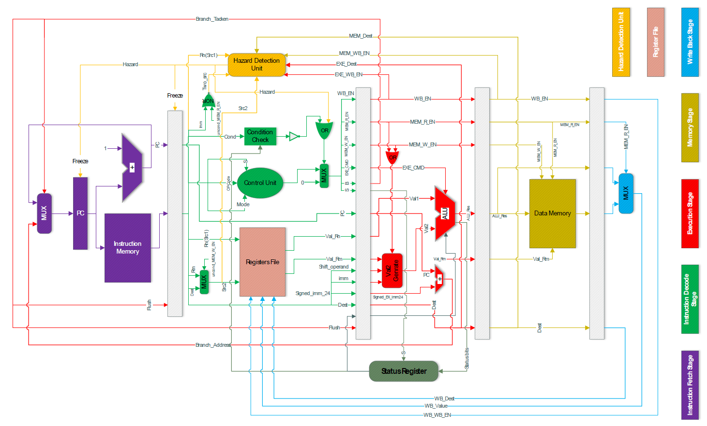
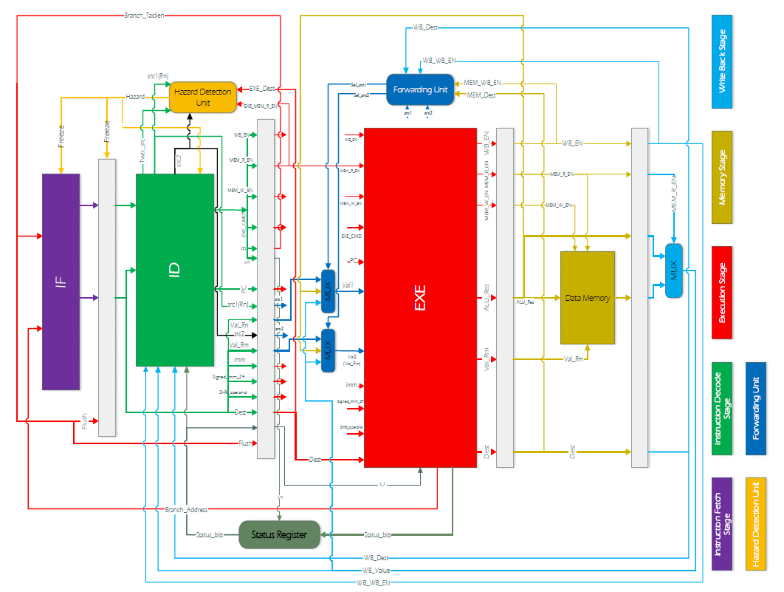
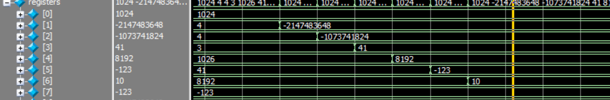
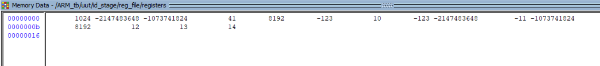
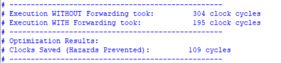
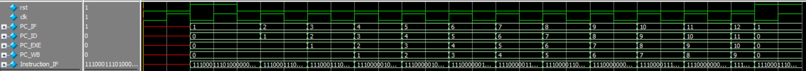
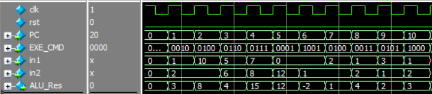
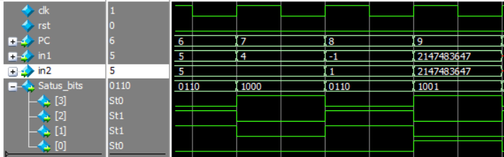

## 📌 Overview

This repository contains the RTL implementation of a 32-bit, 5-stage pipelined ARM processor written in Verilog.
1. **Instruction Fetch (IF):** Program Counter (PC) management and instruction memory access.
2. **Instruction Decode (ID):** Control Unit, Register File, and Condition Check module.
3. **Execute (EXE):** ALU, Branch address calculation, and Operand2 (Val2) Generator supporting Immediate with Rotate and Immediate Shifts.
4. **Memory (MEM):** Data memory access for Load and Store operations.
5. **Write Back (WB):** Commits results back to the Register File.

 **Key Features**
* **Conditional Execution:** Hardware-level support for ARM condition codes evaluated against status flags (N, Z, C, V).
* **Hazard Detection Unit:** Identifies Read-After-Write dependencies and handles them via pipeline stalling and bubble injection.
* **Data Forwarding Unit:** Advanced bypass routing to resolve data hazards dynamically. Implementing this feature improved the benchmark execution time from 304 to 195 clock cycles.
* **Status Register:** Updates and maintains NZCV flags for accurate branching and conditional execution.

Pipeline without forwarding unit:

Pipeline with forwarding unit:

## 📊 Benchmark & Performance Analysis

To verify the complete integrated pipeline, we executed a **Bubble Sort** algorithm. This algorithm rigorously tests the ALU, conditional branches, memory access, and hazard handling by sorting a mix of positive, negative, and extreme 32-bit boundary numbers. 

*   The algorithm successfully sorted the numbers in ascending order in memory and loaded them into registers R1 through R4, resulting in: `-2147483648 < -1073741824 < 41 < 8192`

**Increasing Throughput**
Relying solely on the Hazard Detection Unit to resolve Read-After-Write data hazards severely limits throughput. To fix this, we implemented a **Data Forwarding Unit** that routes calculated data directly from the MEM and WB stages back to the ALU inputs via bypass paths. 
*   **Without Forwarding:** 304 clock cycles.
*   **With Forwarding:** 195 clock cycles.

    

## 🛠️ Pipeline Stages

### Stage 1: Instruction Fetch (IF)
In this stage, the processor calculates the address of the next instruction and fetches the 32-bit instruction code from memory to feed into the pipeline.

### Stage 2: Instruction Decode (ID)
In this stage, the fetched instruction is analyzed, operands are read from the registers, and the necessary control signals are generated to guide the rest of the pipeline.

### Stage 3: Execute (EXE)
This is the computational heart of the processor. In the Execute stage, arithmetic and logical operations are performed, branch target addresses are computed, and the second operand is heavily processed before being fed into the ALU.

**Key Components:**
*   **Status Register:** Updates and stores the four essential status flags: `N` (Negative), `Z` (Zero), `C` (Carry), and `V` (Overflow) if the instruction's `S` bit is active.
*   **Val2 Generator:** A highly flexible module that generates the 32-bit second operand for the ALU. Depending on the instruction, it can process:
    *   8-bit immediate values with rotation.
    *   Direct register values.
    *   Immediate shifts applied to registers.
    *   12-bit sign-extended memory offsets for LDR/STR instructions.
*   **Branch Address Calculator:** Computes the exact destination for jump instructions by sign-extending the 24-bit immediate value and adding it directly to the PC.

### Stage 4: Memory (MEM)
In this stage, the processor interacts with the Data Memory. It handles reading from and writing to the simulated RAM based on the addresses calculated in the previous step.

### Stage 5: Write Back (WB)
The final stage of the pipeline! Here, the processor decides which data needs to be permanently committed to the Register File
